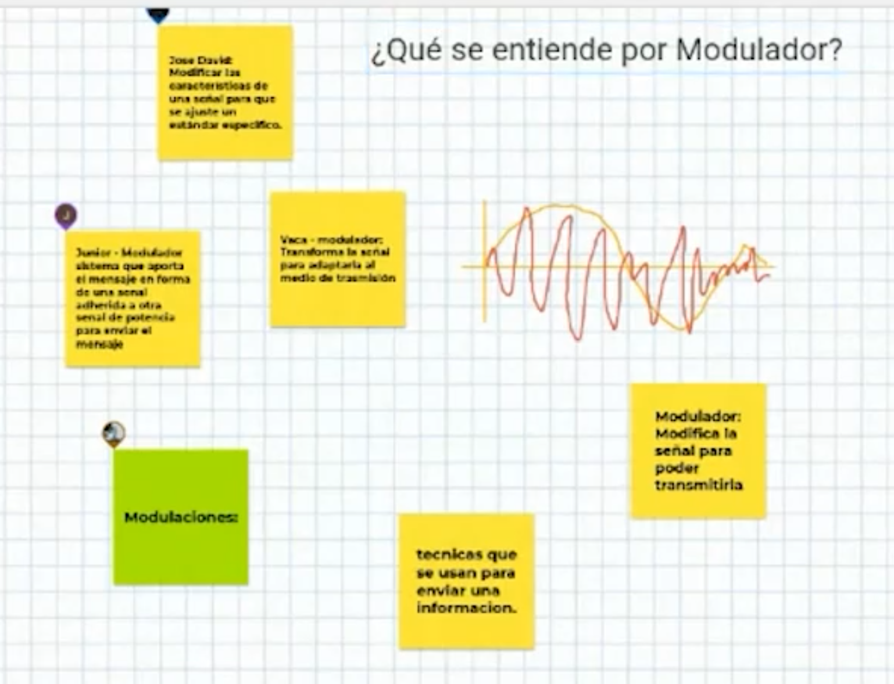

## Enunciado Trabajo Práctico 2

Discusión sobre el concepto de modulación y modulación digital.

### Objetivo

Cononer el concepto que tienen los alumnos respecto del concepto de
modulación y generar una idea unificada del mismo.
Además, se logra que los alumnos se familiaricen con la inclusión
de imágenes en el archivo `README.md` en formato markdown.

### Descripción

Este ejercicio se realiza de manera interactiva durante la clase.

Se discuten los distintos sobre algunos temas:
- ¿Qué se entiende por *Modulador*?
- ¿Qué tipo de modulaciones conocen?
- Modulación analógica vs digital.

Utilizamos un
[jamboard](https://jamboard.google.com/d/14Rc32zSv2SZxCD_AwYwmw8nNAMXTaHe0eJfUeeXiGHE/edit?usp=sharing)
para dejar plasmados los conceptos.

### Entrega

Se debe actualizar el archivo `README.md` de la entrega con imágenes
capturadas del jamboard:
  - Se deben realizar capaturas del jamboard.
  - Se deben subir las imágenes al repositorio (en la carpeta de la entrega).
  - Se deben incluir las imágenes en el archivo Markdown de la entrega.

---
---
---

## Respuestas

- ¿Qué se entiende por *Modulador*?

Es el método de como una señal es modificada adaptada para la transmisión por un medio de manera tal que se utilicen las características necesarias para su recuperación en el receptor.

- ¿Qué tipo de modulaciones conocen?

Modulación por amplitud, por frecuencia, QAM, QPSK, BSPK, Spread Spectrum

- Modulación analógica vs digital.

En modulación analógica afecta a la forma de onda de la señal original, en cambio, en modulación digital se trabaja con los valores lógicos de la señal original (señal discreta)

