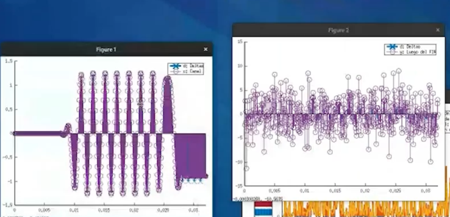

## Enunciado Trabajo Práctico 6

Simulación (demostrativa) del sistema completo incluyendo sincronización.

### Objetivo

Familiarizarse con las dificultades que existen para la sincronización
de símbolo.
Conocer el método de recuperación de reloj utilizando PLL.

### Descripción

En este ejercicio se realiza una demostración de la simulación del sistema con:
- Modulador
- Canal
- Demodulador, incluyendo la sincronización de símbolo.

Se considera el siguiente sistema:

A diferencia de los ejercicios 03 y 05, en este caso no se asume
que el demodulador está sincronizado y por lo tanto se debe implementar
el mecanismo de sincronización.

Se discuten los distintas dificultades involucradas en el proceso de
sincronización.

Se discute la sincronización mediante la utilización de un PLL:
*square-law timing recovery*.

Se brindan los archivos de simulación para que los alumnos puedan realizar
las simulaciones por su cuenta, realizar los gráficos y capturas que
crean necesarios.
Los alumnos son libres de analizar e investigar con mayor detalle el proceso
de sincronización.

### Entrega

La entrega se realiza directamente actualizando el archivo `README.md`
de la carpeta de la entrega.
Allí se deben incluir las distintas capturas de los gráficos y explicaciones
de lo discutido durante la demostración.

Los alumnos son libres de incluir cualquier otro tipo de información que deseen.

1. En la figura 1 se observan los parámetros del sistema.

- Potencia de ruido (Pn)
- Filtro (h(1)=1)
- n_fir, el cual es para el coseno elevado ya que debe haber entre 8 a 10 veces  la cantidad de muestras que se tiene por símbolo.
- det_th, utilizado como valor limite para la detección de la señal a traves del valor de potencia.
- kp y ki, son las constantes proporcional e integral respectivamente utilizado en el pll.
- delay, es utilizado para que la versión digital haga un buen *match* con la versión en HDL.

2. Se muestran el total de transmisiones realizadas (3)

3. Detalle de una transmision.
   - Contiene un preambulo de 16 símbolos.
   - un SFD de 2 símbolos.
   - Se mandan los datos 0x01, 0x02, 0x03 y 0x04 en bytes.

4. Método de detección cuando existe una señal. 
   La linea de color morado indica el valor de la potencia instantánea de la señal recibida y es comparada con un *threshold* para indicar si se esta recibiendo una señal.
   Caso contrario, al no tener un meteodo de detección de señal se estaría demodulando el ruido todo el tiempo, y posteriormente, es probable que se produzca un evento SFD y comience a creer que se encuentra recibiendo datos.

   En detalle se puede observar lo siguiente:
   - En azul, es la señal recibida luego de pasar por el filtro FIR.
   - En naranja, es la señal elevada al cuadrado
   - En amarrillo, es la señal naranja al pasarlo por un filtro pasa bajo.
   
   El *threshold* se encuentra configurado para que a partir de cierto valor de la señal naranja (indicado con las lineas horizontal y vertical) detecte que hay potencia, es decir, esta recibiendo una señal.
   

   Una vez disminuye por debajo del umbral, ya no se estaría recibiendo una señal.

5. La "Figura 6" generada por el programa muestra las señales relacionadas con el PLL

6. A continuación se observa en detalle la obtención de la frecuencia por PLL
   - La señal en rojo realiza la estimación de la fase y la de amarillo es el error instantáneo.
   - La señal morada es una señal que se acomoda para encontrar la frecuencia de oscilación. Generando las señales inferiores que son casi senoidales.

7. Las señales no son senoidales exactas. Estas detectan si la senoidal es positiva o negativa y de esta forma se obtiene la señal de *clock*.

8. A continuación se puede observar un delay entre la señal entrante (la señal elevada al cuadrado y filtrada) y la señal en rojo.
   Ambos se encuentran relacionados debido a que en un primer momento la señal de *preámbulo* permite obtener una muy buena amplitud en la señal roja, lo que permite obtener el clock requerido. Posteriormente dicha amplitud decae debido a que se comienzan a enviar datos y no necesariamente habrá un continuo cambios de 1 y 0.

9. La señal morada indica que el preámbulo y el PLL intentan sincronizarse. Posteriormente, ya sincronizado, este se mantiene hasta que se deja de recibir la señal y pierde el sincronismo.

10. En la siguiente figura se muestra en mayor detalle la señal recibida, el PLL y los momentos en que se deberá realizar el muestreo de la señal indicados por las lineas verticales.

    Luego, se puede observar como los pulsos (en forma de triangulo) se encuentran muestreando en cada uno de los flancos. El pulso rojo indica que es el flanco negativo del coseno de la señal (Q).

    Una vez estabilizado el PLL se puede observar que el pulso rojo (Qn) comienza a coincidir con la frecuencia de muestreo de forma correcta. Lo que permite muestrear los datos recibidos de manera correcta.

    Por último, al terminar la transmisión de los datos, es decir termina la señal recibida, se pierde la sincronización y lo vuelve a retormar en la siguiente transmisión.

#### Variación del código - Ruido

1. Se procedió a variar el código incrementando a 30 el número de transmisiones, manteniendo el nivel d ruido en cero.
   Observandose la diferencia entre los bytes mandados (en celeste) y los bytes recibidos (verde) por lo que se infiere que el sistema es pobre y esta perdiendo datos.

2. En otra simulación se incrementó la potencia de ruido a 0.1 observandose que el sistema funciona muy bien en diversos puntos, aunque se esten perdiendo bytes de datos (se perdieron 8 bytes, es decir, 2 transmisiones).

3. Al incrementar la potencia del ruido a un valor de Pn = 10, todo el sistema cae y no es capaz de funcionar correctamente.
   - La señal recibida contiene mucho ruido.

   - Ya no es posible detectar si se recibe una señal a traves de la potencia de la misma (linea morada).

   - El PLL  se vuelve inestable ya que no se puede obtener bien el *clock*.

   - No es posible sincronizar punto alguno (imposible hacer un correcto muestreo).

   - Se recibe un valor que no se envío (214)

#### Variación del código - PLL

1. Al modificar los valores de las constantes proporcionar e integral del PLL estas impactan en la misma, por lo tanto, estos valores deben sintonizarse de manera correcta para hacer más robusto el sistema.
   
   - Incrementando "kp" hace que vaya más rapido al valor requerido pero luego comienza a oscilar constantemente

   - Al incrementar "ki" hace que se filtre la señal, es decir, el PLL se vuelve muy sensible

