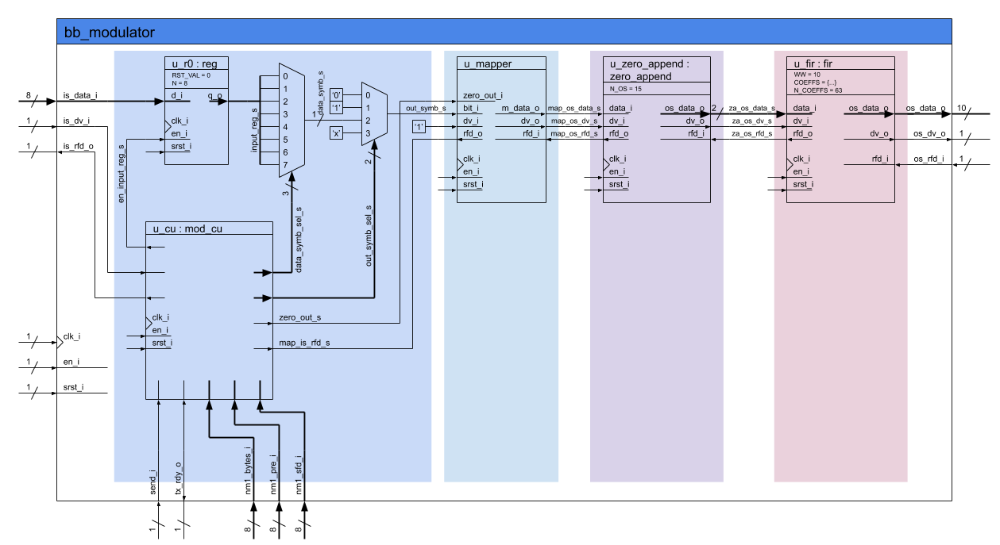
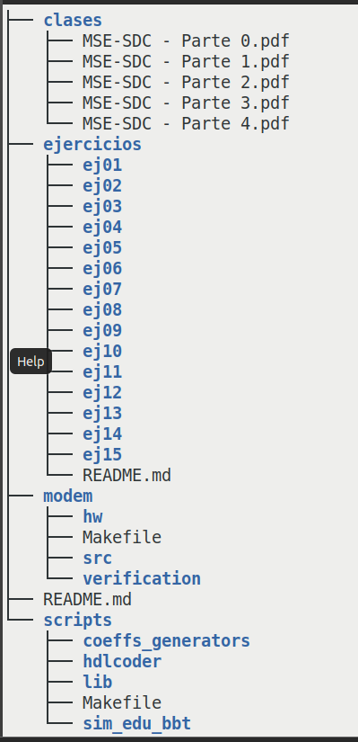
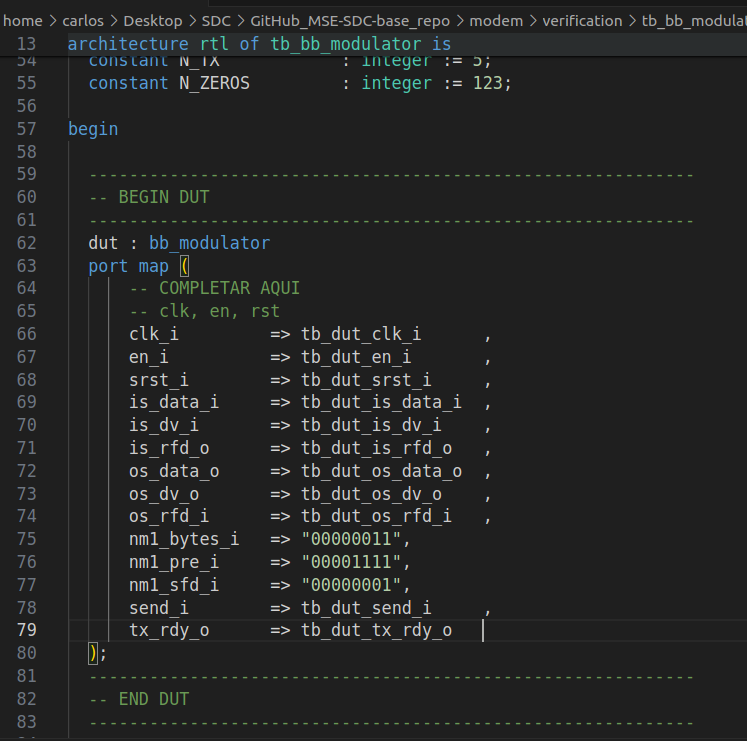
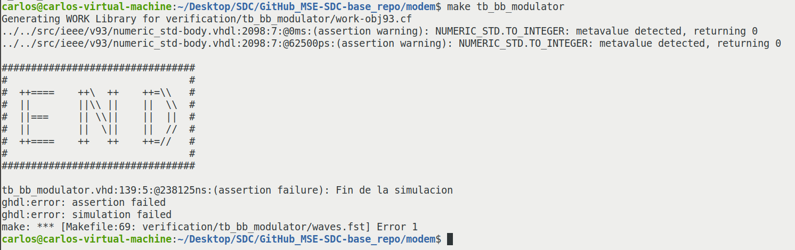

## Enunciado Trabajo Práctico 7

Simulación del código RTL del modulador:


### Objetivo

Familiarizarse con la simulación de código RTL en el repositorio
y el bloque del modulador.


### Diagramas en bloque



### Descripción

En este ejercicio se debe simular el modulador, para ello:
1. Revisar estructura del respositorio en el archivo [README](../../README.md) 
    principal del repositorio.

2. En la carpeta `MSE-SDC-repo/modem/verification/tb_modulator/` encontrarán
    un testbench incompleto, en el cual falta instanciar el modulador.
    Se debe completar.

3. simular el modulador, para ello se puede utilizar:

    1. El software *GHDL* y *GTKWave*:
        Utilizar el `Makefile` ubicado en la carpeta
        `MSE-SDC-repo/modem/`.
        Para simular se puede utilizar:
        ```
        $ make tb_bb_modulator
        ```
        Para visualizar las señales con *GTKWave*:
        ```
        $ make gtkwave_tb_bb_modulator
        ```
    2. El software *Vivado* de *Xilinx*:
        Para ello se debe crear un nuevo proyecto con el SW
        (por favor mantener el workspace fuera del repositorio).
        Luego agregar todos los archivos/carpetas de la carpeta `src` como
        archivos de simulación e implementación.
        Incluir el archivo del testbench como archivo de simulación únicamente.

3. Se deben buscar y visualizar todas las señales de interés en la simulación:
    - Tren de deltas.
    - Señal de salidas del filtro FIR.
    - Las señales de control.

    Las señales de datos se deben mostrar en formato "analógico".
    Opcionalmente se puede configurar al visualizador de señales para
    que respete la aritmética de cada una se las señales.


### Entrega

La entrega se realiza directamente actualizando el archivo `README.md`
de la carpeta de la entrega.
Allí se deben incluir las distintas capturas del visualizador y una breve
explicación sobre lo que se está mostrando en cada caso.

Se debe guardar el archivo de configuración del visualizador `gtkw` o `wcfg`
(GTKWave o Vivado respectivamente) en la misma carpeta que el test, en este
caso en la carpeta `MSE-SDC-repo/modem/verification/tb_modulator/`, de manera
que sea simple y rápido volver a visualizar las señales de acuerdo a la
configuración utilizada por el alumno.

Los alumnos son libres de incluir cualquier otro tipo de información que deseen.

---
---
---

# Resolución

1. Estructura del respositorio.
   


2. Codigo para instanciar el modulador en el archivo tb_bb_modulator



3. Ejecución del test a correr.



4. Visualización del **Tren de deltas**
   Se visualiza el tren de deltas a la salida del bloque *zero append*


5. Visualización de **la señal de salidas del filtro FIR**
   La señal de salida del filtro FIR esta en formato Q10.8 y se visualiza en la siguiente figura, en formato hexadecimal, decimal con signo y analógico con signo.
   


6.  Visualización de **las señales de control**
   El sistema posee señales de control y estado
   - tb_bb_modulator.tb_dut_send_i: Inicio de la transmisión
   - tb_bb_modulator.tb_dut_tx_rdy_o: Estado Modulador listao para transmitir.
  
   - tb_bb_modulator.dut.u_cu.nm1_bytes_i[7:0]: Cantidad de bytes a transmitir por transmisión
   - tb_bb_modulator.dut.u_cu.nm1_pre_i[7:0]: Tamaño de preambulo en longitud de símbolos.
   - tb_bb_modulator.dut.u_cu.nm1_sfd_i[7:0]: Tamaño del SFD en símbolos.


7.  Visualización de **las señales de datos en formato analógico**
   - Señal de salida en formato analógico DAC Q10.8


Utilizando el archivo de configuración `ej07.gtkw` se observan las señales del Testbench (entrada, salida, control y estatus).
También se muestra el proceso de conversión del dato a transmitir:
- Valores de bytes en la entrada
- Adición de preambulo, sfd y datos
- Conversión de numeros binarios 0 y 1 a -1 y 1
- ZeroAppend para generar el tren de pulsos
- Shaping FIR para la generación de la señal de salida en formato Q10.8 (digital a analógico)


