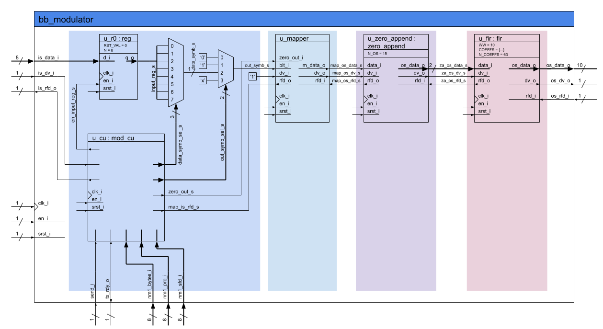
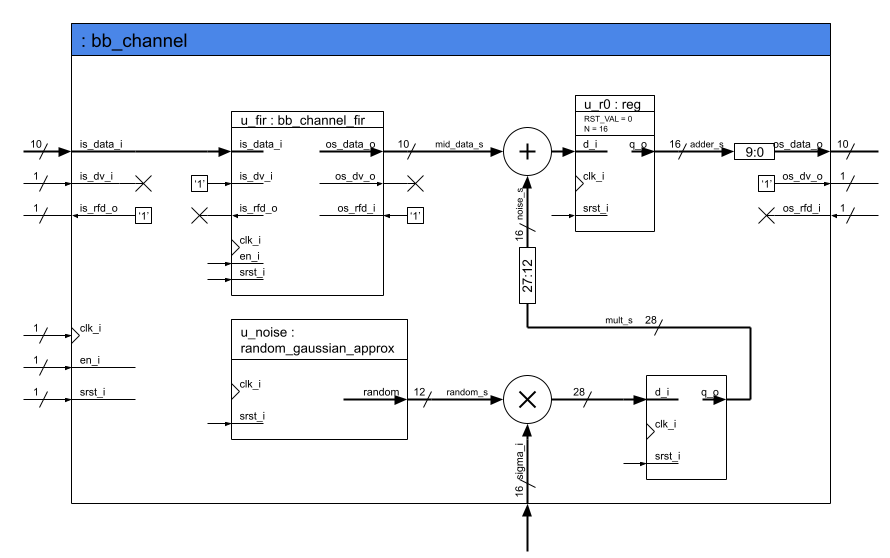
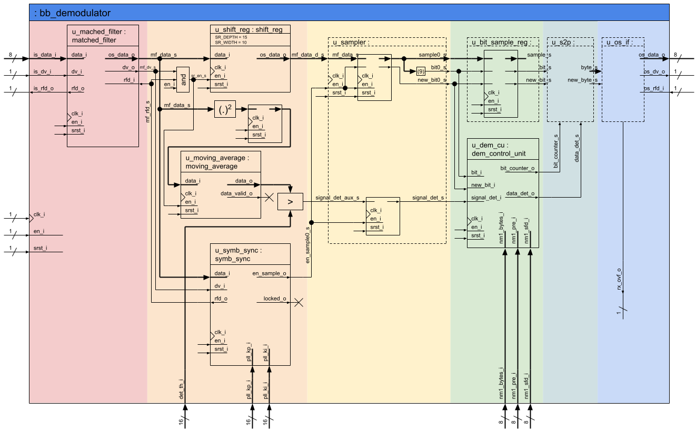
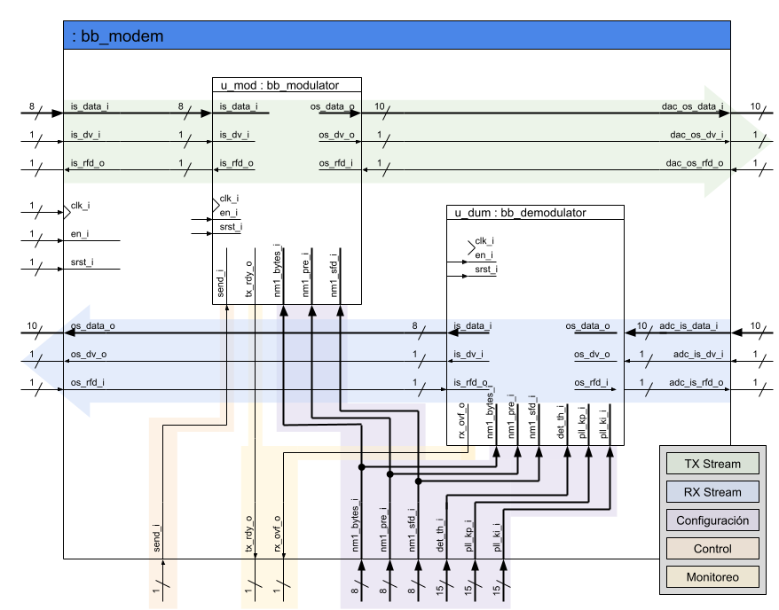
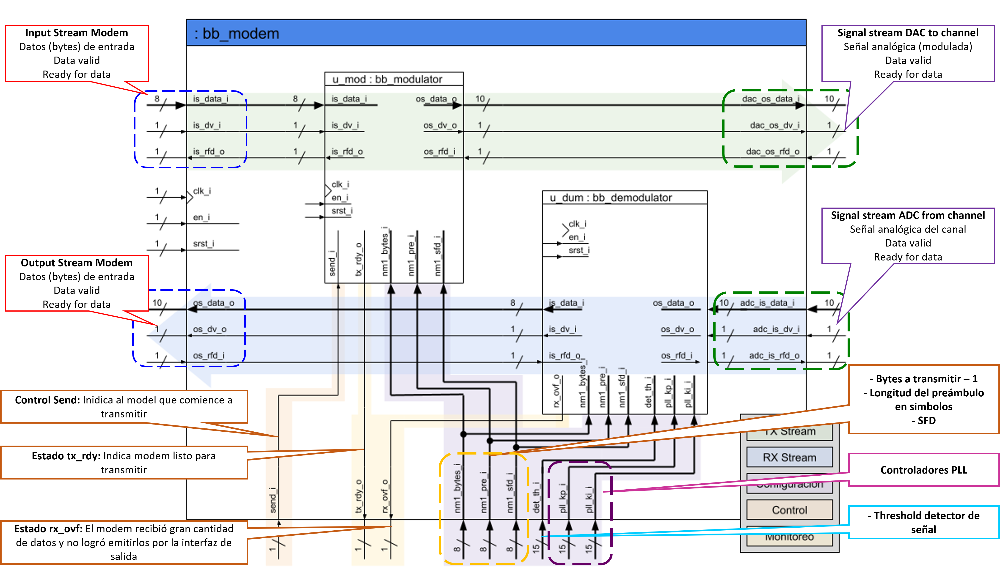

## Enunciado Trabajo Práctico 9

Simulación del código RTL del modem y el canal.

### Objetivo

Familiarizarse con bloque del demodulador y el bloque del modem
que incluye tanto al modulador como al demodulador.

### Diagramas en bloque

### Descripción

En este ejercicio se debe simular el modem junto con el canal, para ello:
1. Se debe crear un nuevo test en en el repositorio.
    Revisar el ejercicio anterior, en caso de no recordar cómo crear los test.
2. En el testbench se deben instanciar el modem junto con el canal.
3. Se debe simular el modulador y el canal.
    Revisar el ejercicio anterior en caso de no recordar cómo simular.
4. Se deben buscar y visualizar todas las señales de interés en la simulación:
    - Grupo 1:
      - Tren de deltas.
      - Señal de salidas del filtro FIR.
      - Señal de salida del canal.
      - Señal de salidas del filtro adaptado.
      - Señal subsampleada.
      - Señal de secuencia binaria estimada.
    - Grupo 2:
      - Las señales de control.
      - Las señales utilizadas para la sincronización.

    Las señales de datos se deben mostrar en formato "analógico".
    Opcionalmente se puede configurar al visualizador de señales para
    que respete la aritmética de cada una se las señales.

### Entrega

La entrega se realiza directamente actualizando el archivo `README.md`
de la carpeta de la entrega.
Allí se deben incluir las distintas capturas del visualizador y una breve
explicación sobre lo que se está mostrando en cada caso.

Se debe guardar el archivo de configuración del visualizador `gtkw` o `wcfg`
(GTKWave o Vivado respectivamente) en la misma carpeta que el test, en este
caso en la carpeta `MSE-SDC-repo/modem/verification/tb_test_modem_channel/`, de manera
que sea simple y rápido volver a visualizar las señales de acuerdo a la
configuración utilizada por el alumno.

Los alumnos son libres de incluir cualquier otro tipo de información que deseen.

---
---
---

## Resolución

1. El testbench se encuentra con el nombre `tb_test_modem_channel`
2. Se deben buscar y visualizar todas las señales de interés en la simulación:
   
   El sistema realiza dos transmisiones de 4 bytes cada uno.
   Los datos digitales entran al modem a traves del `Input stream modem`, posteriormente es modulada mediante el `bb_modulator` obteniendose una señal en formato Q10.8 el cual ira al DAC.
   Luego cuando se recibe los datos desde el canal, vienen a traves del ADC, y luego va al `bb_demodulator` en formato Q10.8.
   A diferencia del modulador, el cual posee señales de control del número de bytes a transmitir, tamaño del preámbulo, tamaño del SFD, el demodulador posee 3 señales más, los cuales son: el threshold (utilizado en la detección de la señal), constantes utilizadas para la sintonización del PLL.
   Además, el modulador también cuenta con una señal de control `send_i` para el inicio de la transmisión, posee una señal de estado `tx_rdy_o` que indica que se encuentra listo para realizar una transmisión.
   En cambio, el demodulador posee una señal de estado `rx_ovf_o` el cual emite un flanco positivo cuando la cantidad de datos recibidos desde el canal no son rápidamente emitidos a traves de la interfaz, es decir, mostrados en la señal `os_data_o`
   

    
   - Tren de deltas.
  Se muestra el tren de deltas (grafica morada) a partir de la señal del *mapper*
  

   - Señal de salidas del filtro FIR. (gráfica analógica verde)
  Los pulsos de deltas pasan a traves del filtro *pulse shaping* para luego ir al DAC.
  

   - Señal de salida del canal.
  Una vez la señal pasa a través del canal, resulta en una señal afectada (señal naranja) y con ruido gausiano aditivo.
  

   - Señal de salidas del filtro adaptado.
  A fin de mejorar la relación señal ruido, se pasa por el filtro adaptado. Se observa la señal (amarillo) proveniente del canal con ruido y su mejora a la salida.

   - Señal subsampleada.
  La señal anterior es subsampleada y se obtiene la señal en rojo.

   - Señal de secuencia binaria estimada.
  Luego, se estima la secuencia binaria transmitida a partir de la señal anterior.

   - Las señales utilizadas para la sincronización.
A fin de que se logre la sincronización, el PLL realiza los cálculos utilizando los valores de `kp` y `ki`, para hallar el `Error de Fase` (en color rojo)

