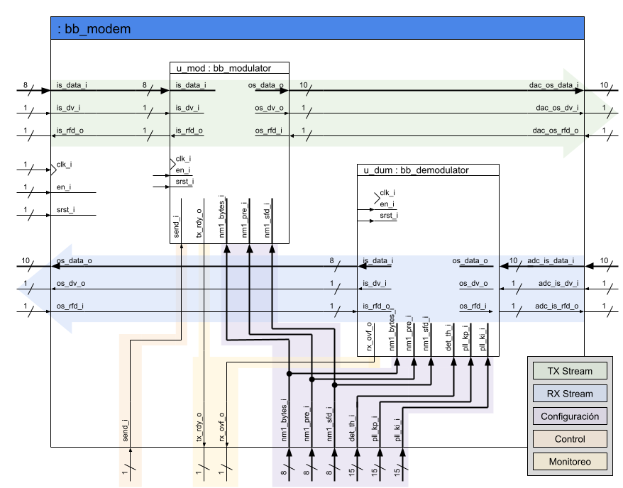
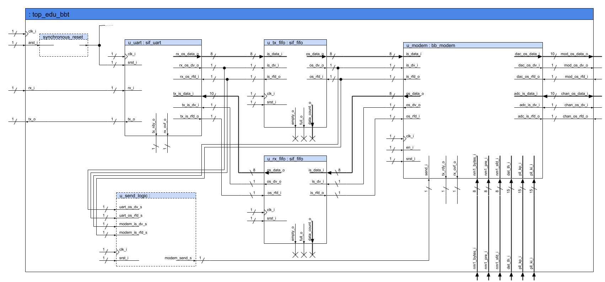
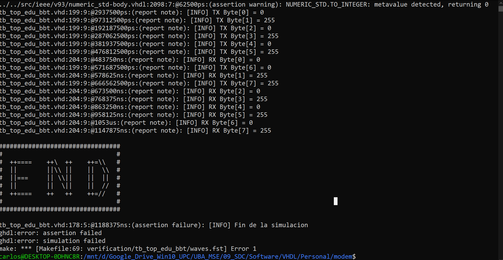
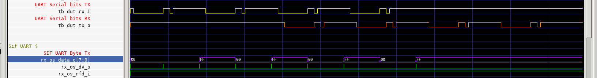
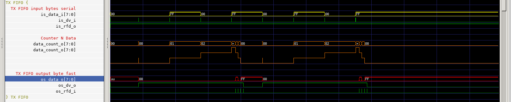
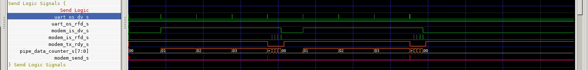
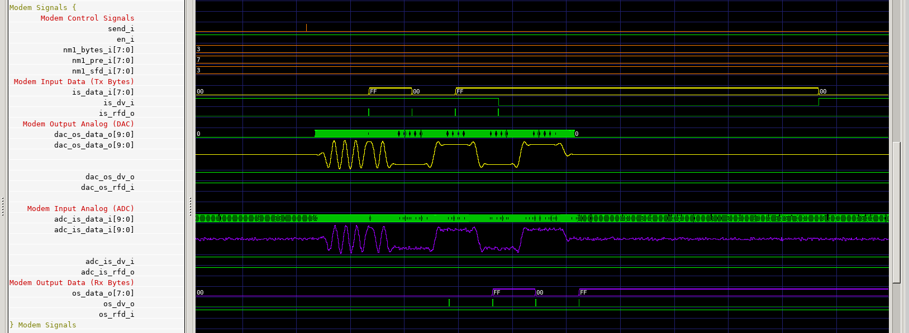
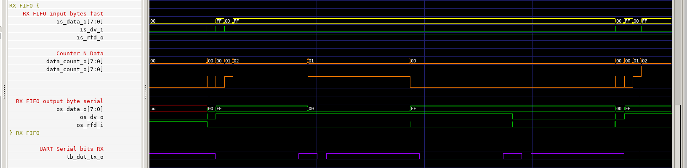
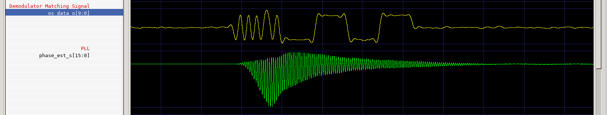

## Enunciado Trabajo Práctico 10

Simulación del código RTL del sistema completo.

### Objetivo

Familiarizarse con sistema completo, incluyendo:
- Modem
- Emulador d canal
- Unidad de control
- FIFOs
- UART

### Diagramas en bloque

### Descripción

En este ejercicio se debe simular el sistema completo, para ello:
1. Ya se cuenta con el test creado, se llama `tb_top_edu_bbt`.
2. Se debe simular el sistema completo.
3. Se debe entender el funcionamiento del sistema completo.
4. Se debe realizar una explicación del funcionamiento de cada bloque.
    Para ello ayudarse mediante capturas de las señales necesariar.
5. Se debe realizar una explicación del funcionamiento del sistema completo.
    Para ello ayudarse mediante capturas de las señales necesariar.
6. Se debe incluir una explicación y capturas que muestren los problemas
    que existen en la sincronización, al no estar en presencia de
    cambios en las señales.
    Por ejemplo, comparando como se degradan las señales de sincronización
    en un caso con muchos cambios y en un caso con pocos.
7. Todo el contenido se debe volcar en un informe breve.

### Entrega

La entrega se realiza directamente en la carpeta del repositorio.
El informe puede ser directamente el archivo `README.md` de la carpeta
de entrega o bien un archivo pdf.
Si la entrega es mediante un archivo pdf, entonces se debe incluir un
link al archivo en el `README.md` de la entrega.

**No es necesario que el informe sea una maravilla literaria, ni que su
presentación sea impecable, pero si debe ser claro y fácil de leer.**

Los alumnos son libres de incluir cualquier otro tipo de información que deseen.

---
---
---

## Resolución

1. Se debe simular el sistema completo.

2. Se debe realizar una explicación del funcionamiento del sistema completo.
   

   - La PC realiza una transmisión de datos binarios UART a través de `rx_i`, el cual es acondicionado para una interfaz de *streaming* (`data`, `data valid` y `ready for data`).
  En la imagen se muestra la transmisión serial tanto Tx(amarillo) como Rx (naranja) y posteriormente se convierte en interfaz *streaming* en el bloque `Sif UART` (violeta)

   - Luego este byte (amarillo) es transmitido al acumulador *TX FIFO* a fin de que se junte la cantidad (naranja) de bytes necesarios (rojo) para realizar una transmisión.

   - Una vez se hayan acumulado los suficientes datos para realizar un envío, el bloque *Send_Logic* se encarga de realizar la lógica de control a fin de habilitar la señal de inicio (rojo) de envío de datos por parte del *Modem*

   - Posteriormente, los bytes a transmitir (señales en amarillo) son manejados por el bloque *Modem* el cual los envía a través de un modulador hacia un *Canal* quien modifica la señal y la devuelve, además, con ruido gausiano. Dicha señal (señales moradas) es obtenida y enviada a traves del *Demodulador* del *Modem*, para posteriormente emitirlo a traves de su interfaz de salida.
   - Los datos en bytes obtenidos por el *demodulador* van hacia el *RX FIFO* los cuales emiten los bytes cada vez que se encuentren disponibles hacia el bloque *SF_UART*

   - Una vez recibido en el bloque *UART* este es transmitida en por UART (violeta) hacia la PC.

   - Al poseer una señal *reset* asincrona, es necesario como buena práctica volverla síncrona, para ello se hace uso del bloque *Synchronous reset*.

4. Se debe incluir una explicación y capturas que muestren los problemas
    que existen en la sincronización (PLL), al no estar en presencia de
    cambios en las señales.
    
    Se observa como al tener cambios constantes (nivel alto y bajo) de la señal recibida y tratada por el filtro adaptivo, una de las señales (verde) en el proceso de sincronización tiene una alta amplitud, la cual va bajando a medida que la señal recibida deja de tener cambios.
    

