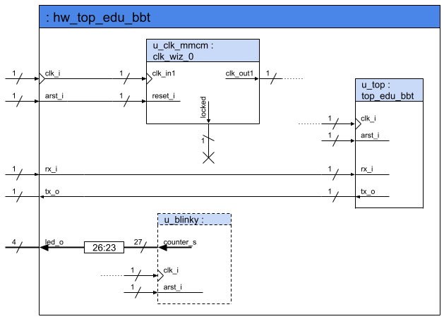
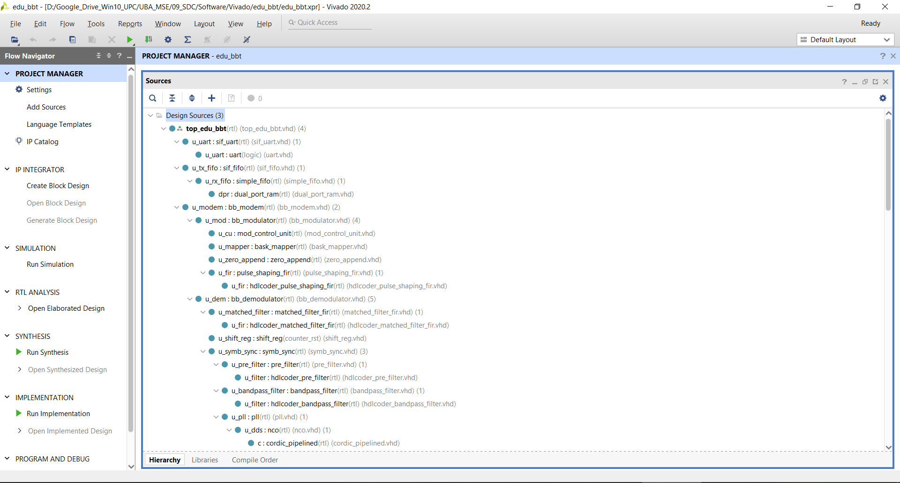
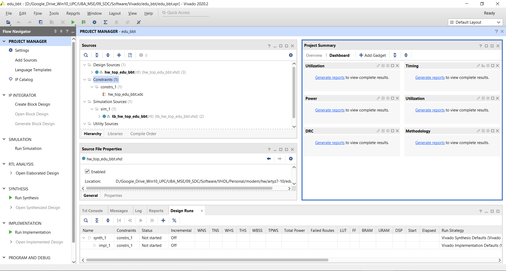
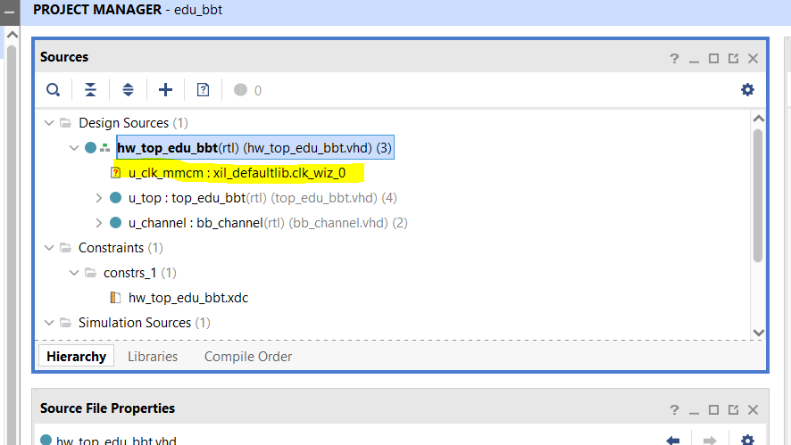
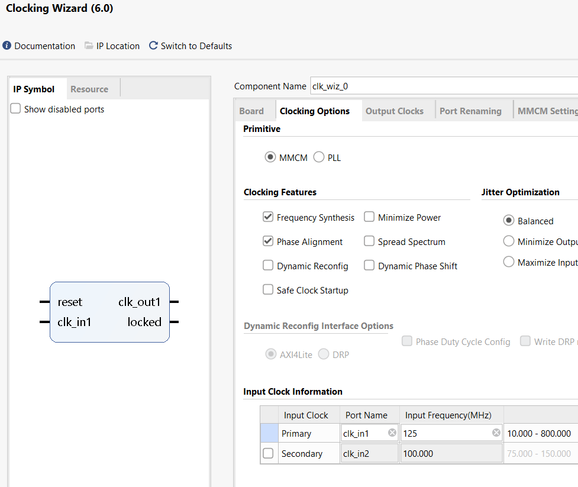
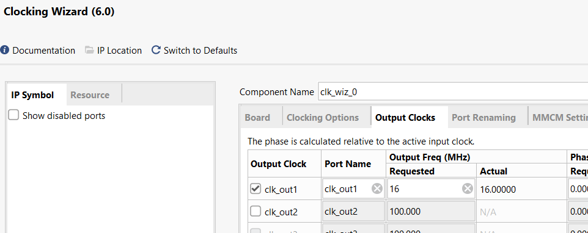
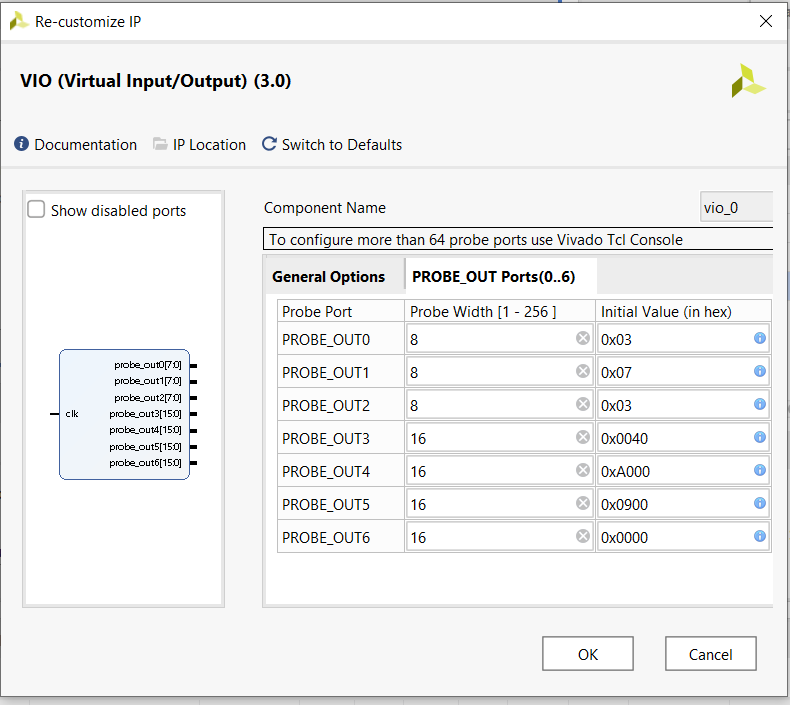
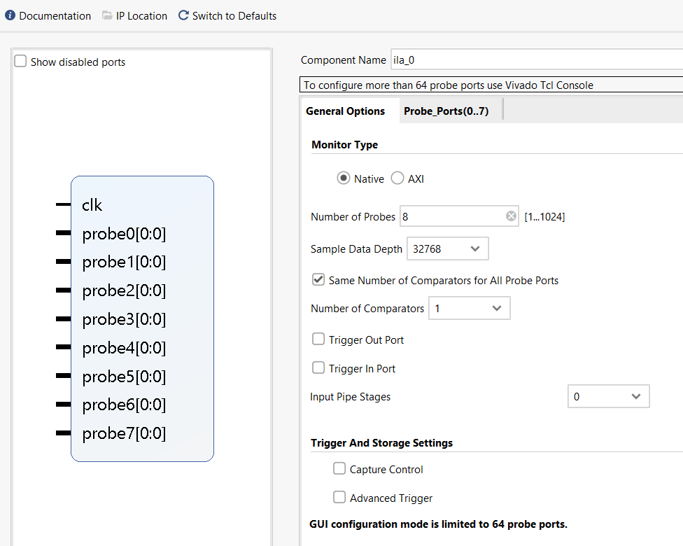

## Enunciado Trabajo Práctico 11

Implementación en FPGA del sistema.

### Objetivo

Implementar el modem (y el resto del sistema) en FPGA y verificar su
correcto funcionamiento.

Familiarizarse con los IP de Xilinx:
- Integrated Logic Analyzer (ILA)
- Virtual Input/Output (VIO)

### Diagramas en bloque

### Descripción

**ToDo:** Completar

- Proyecto Vivado
- Agregar MCMM
- Simular
- Implementar
- Agregar ILA
- Agregar VIO

### Entrega

La entrega se realiza directamente en la carpeta del repositorio.
El informe puede ser directamente el archivo `README.md` de la carpeta
de entrega o bien un archivo pdf.
Si la entrega es mediante un archivo pdf, entonces se debe incluir un
link al archivo en el `README.md` de la entrega.

**No es necesario que el informe sea una maravilla literaria, ni que su
presentación sea impecable, pero si debe ser claro y fácil de leer.**

Los alumnos son libres de incluir cualquier otro tipo de información que deseen.

---
---
---

## Resolución

- Proyecto Vivado
  - Se realizó una configuración para el uso de la placa Artyz z7-20.
  - Se agregó la carpeta `modem/src`, la cual contiene todos los archivos necesarios para el proyecto.

  
  - Así mismo, se debe agregar el archivo para la simulación y los *constraints*, de forma que resulte como la imagen.
  

- Agregar MCMM
  - Se puede observar en el Vivado la falta de un generador de reloj. Por tanto, se agregará utilizando el IP Core.

  - Se actualiza la frecuencia de entrada a 125 MHz y la frecuencia de salida a 16 Mhz

- Agregar VIO
  
  Se utilizaran 7 señales e control, de de 8 bits y 4 de 16 bits. Además se les dará un valor inicial.

- Agregar ILA
  - Se utilizarán los datos transmitidos del *modem al canal* y del *canal al modem*

- Simular

- Implementar

